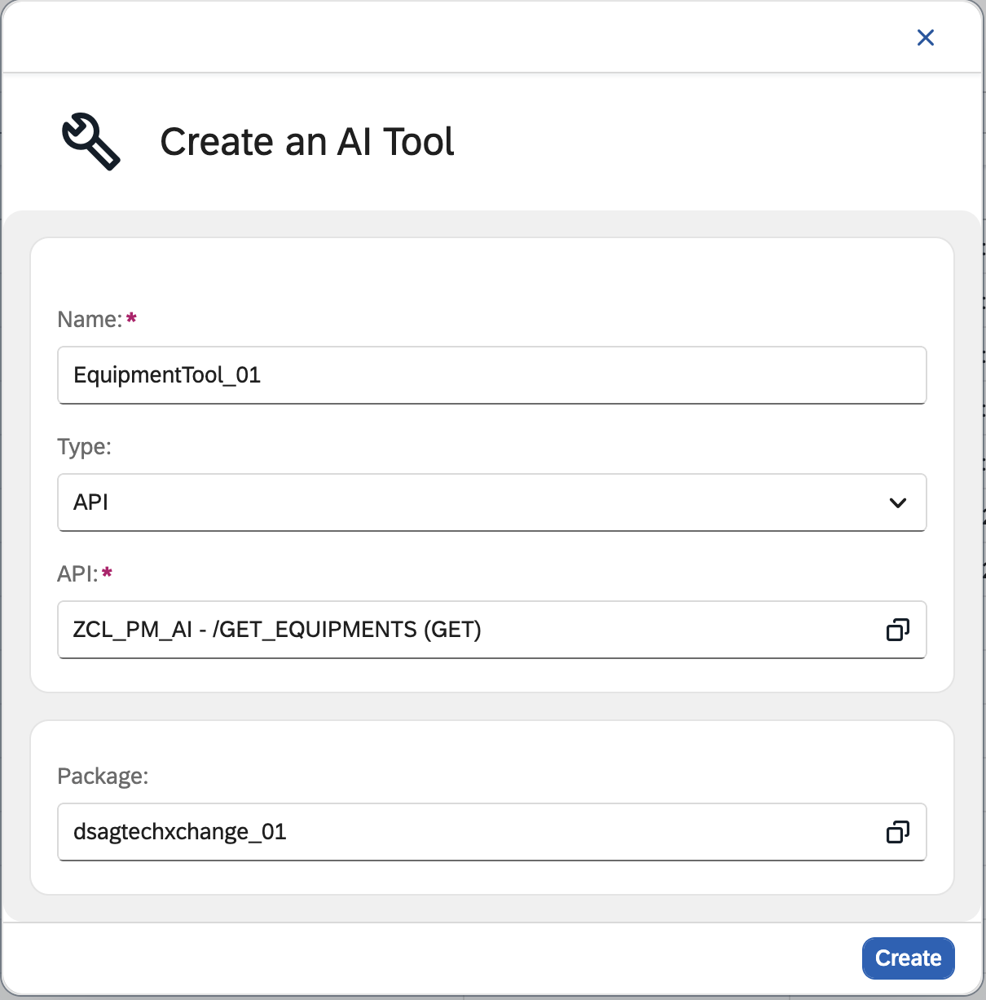
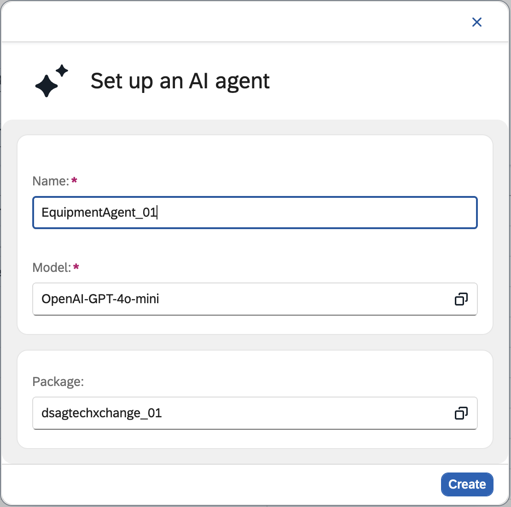
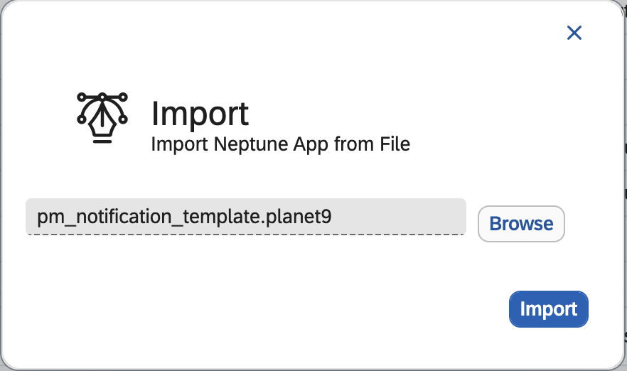
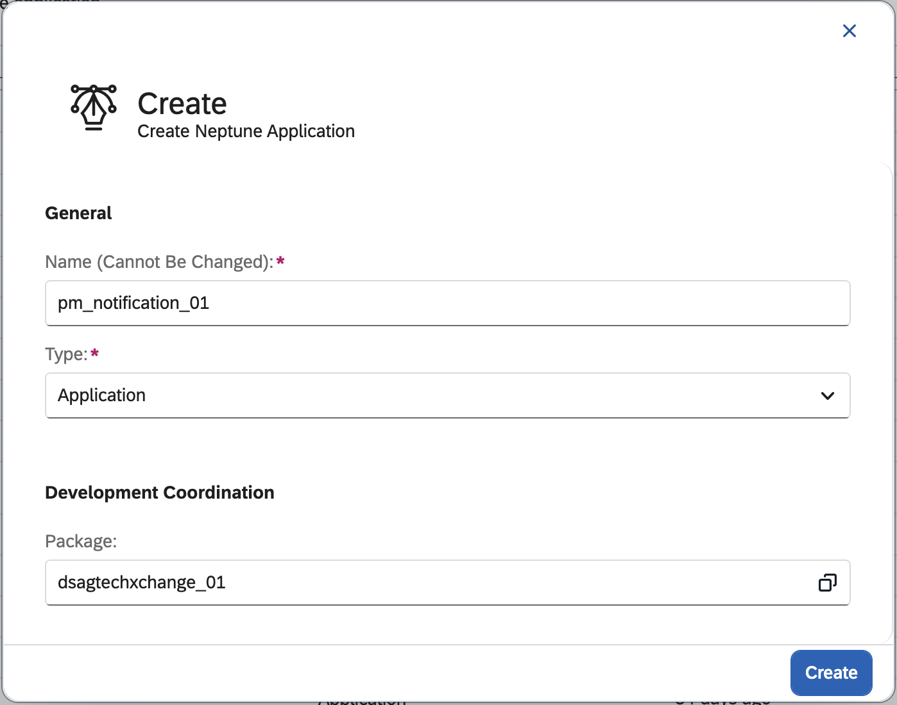
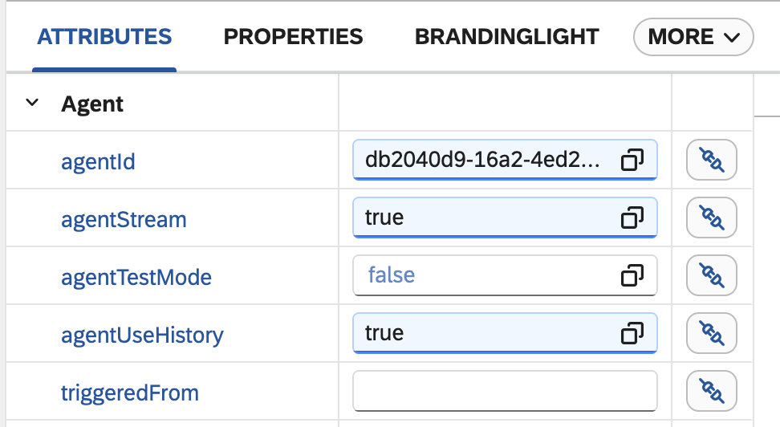
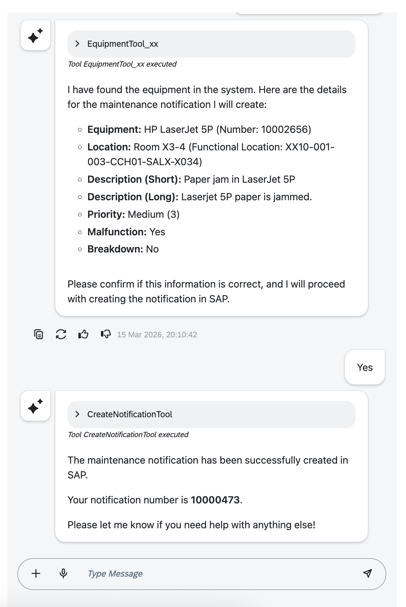
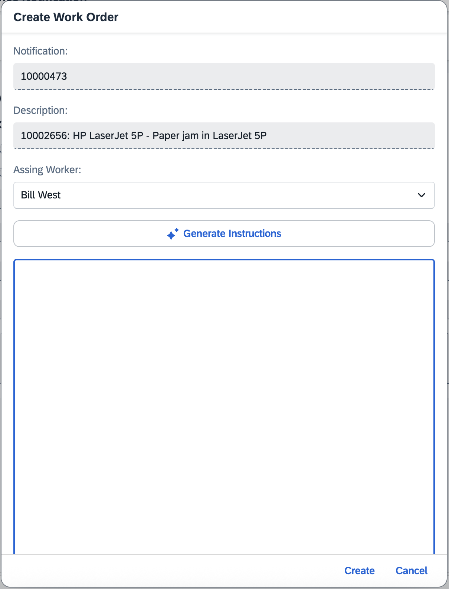
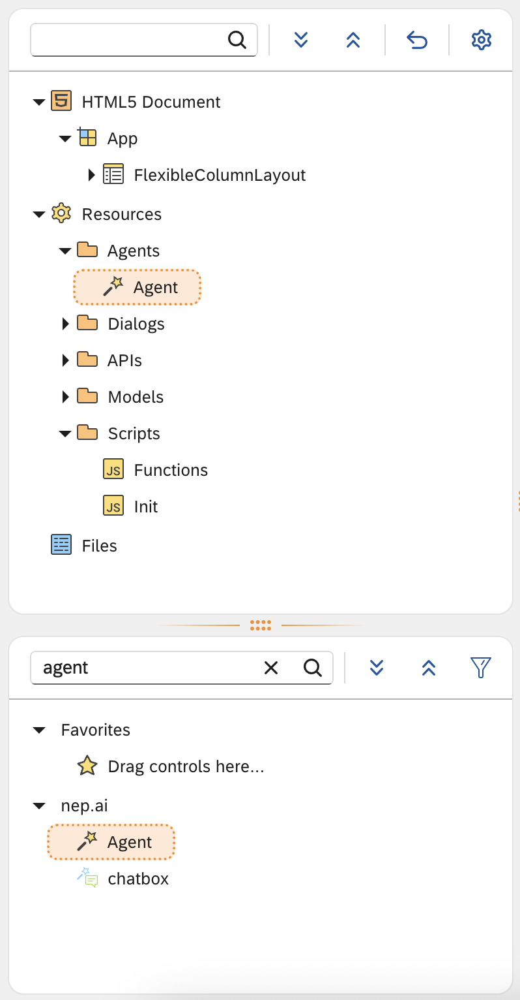
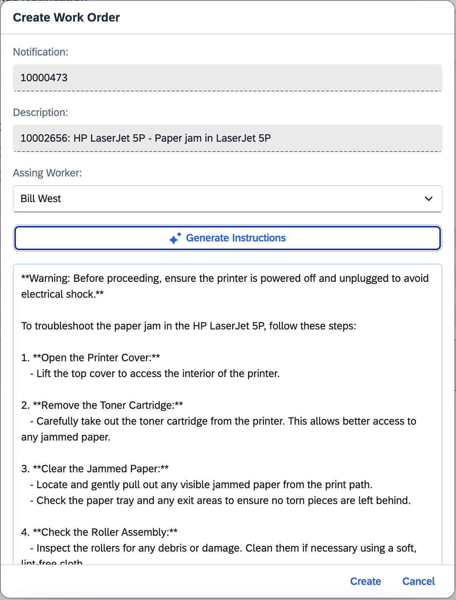

# Build your agents with Neptune DXP

Hands-on Session as part of the [DSAG TechXChange 2026](https://dsag.de/wp-content/uploads/2025/12/DSAG_TechXchange26_Agenda.pdf)


Build AI-powered SAP PM extensions with a clean-core approach and deliver them in a Fiori-like mobile app with offline capabilities.

| Quick Facts | Details |
|-------------|---------|
| Duration | ~2 hours |
| Level | Beginner to Intermediate |
| Delivery | Hands-on workshop |
| Stack | Neptune DXP, Naia, SAP ECC / SAP S/4HANA |
| Result | Working AI agents + mobile PM app flow |

## Table of Contents

- [Goal](#-goal)
- [Quick Start](#-quick-start)
- [Logistics](#-logistics)
- [Neptune DXP](#-neptune-dxp)
- [Exercise 01: My First Agent](#-exercise-01-my-first-agent)
- [Exercise 02: AI Tools](#-exercise-02-ai-tools)
- [Exercise 03: Create Plant Maintenance Notifications in SAP with Agent chat](#-exercise-03-create-plant-maintenance-notifications-in-sap-with-agent-chat)
- [Exercise 04: Vectorize Equipment Data (Manuals) and use it in App](#-exercise-04-vectorize-equipment-data-manuals-and-use-it-in-app)
- [Troubleshooting](#-troubleshooting)
- [What You Built](#-what-you-built)
- [Bonus Exercise 05: Naia Build](#-bonus-exercise-05-naia-build)

## ⚡ Quick Start

1. Open Neptune Cockpit: `https://dsag26.neptune-software.cloud/cockpit.html`
2. Log in with your workshop user (`dsagxx`) and provided password.
3. Confirm your package for this workshop (`dsagtechxchange_xx`).
4. Complete Exercise 01 and test in Playground.
5. Continue through Exercises 02-04 to connect tools, app, and agent flow.

---

## 🥅 Goal

In this session, we want to show how easily Neptune DXP, combined with Naia's latest agent capabilities, can extend SAP Plant Maintenance (SAP PM) processes while maintaining a clean core. You will learn how Neptune's No-Code/Low-Code tooling and built-in AI support make app development very efficient and how agents can help improve custom processes.

As a result, you will have built a Fiori-like mobile app with offline capabilities using SAP Cloud ERP Private Edition (S/4HANA) and Neptune DXP including Naia. We will use a Neptune DXP Demo system, so you can continue to play around with what you build after the workshop.

---

## 🚚 Logistics

| Neptune User |
|--------------|
|dsag01|
|dsag02|
|dsag03|
|dsag04|
|dsag05|
|dsag06|
|dsag07|
|dsag08|
|dsag09|
|dsag10|

Password will be provided during the workshop. 

---

## 🤝 Neptune DXP

Login to the Neptune Cockpit

https://dsag26.neptune-software.cloud/cockpit.html

- Username: dsagxx (for xx user your group number e.g. dsag01)

> [!NOTE]
>🏋🏽You can easily download your own free Trial system here
> [Neptune Software Free Trial](https://www.neptune-software.com/free-trial/)
>
> or use our hosted Trial system [Neptune Hosted Trial](https://trial.neptune-software.cloud/)

---

## 🚧 Exercise 01: My First Agent

| At a Glance | |
|-------------|-|
| Estimated time | 30-40 min |
| You will build | Your first Naia agent |
| Outcome | Working agent with instructions and system variables |

**Introduction Naia Studio**
 
Naia Studio is the workspace where you create, configure, and manage your AI agents inside Neptune DXP. It provides all the tools you need to design, customise, and control how your agents behave.

Inside Naia Studio, you can choose which AI model you want to use, connect it to an agent, and enhance that agent with a wide range of AI Tools. These tools enable your agent to take action — such as reading tables, calling APIs, executing logic, sending emails, or searching the web. Once configured, agents can be delivered to end users through the built-in chat client.


To ensure safe and predictable behaviour, Naia Studio allows you to configure guardrails — rules that restrict what an agent is allowed to accept or generate. These keep your agent controlled, compliant, and aligned with your organisation’s standards.

All activity inside an agent’s lifecycle is captured in Agent Trace. From here, you can review logs, inspect tool usage, understand reasoning steps, and monitor token consumption.

It has never been easier to create an AI Agent. All it takes is a few clicks, so let’s jump right in and build one together.

### Create your first AI Agent

From the Cockpit, open the search bar, type **Agent**, and select **Agent** from the list.

In the top-right corner, click **Create** to start setting up your new agent. You will now see a small setup window where you provide the basic details of your agent.

Fill in the following fields:
- **Name**: Give your agent a name, for example: `MyFirstAgent_xx`. Replace `xx` with your group/user number. Eg. `MyFirstAgent_01`
- **Model**: Select `Gemini-3`.
- **Package**: Choose the package matching your user/group number where your agent should be stored. Eg. `dsagtechxchange_01`

**Congratulations!**
You’ve just created your first AI Agent.

Now that your agent exists, let’s give it some behaviour.

Navigate to the **Agent Instructions** tab at the top.
Here is where you define how your agent should speak, act, and respond.

To make this quick:
- Click **Add Example Instructions**
- From the dropdown, choose **Simple**


This inserts a short, ready-to-use instruction template.

You’ll notice that the simple instruction automatically includes a variable: {{name}}


This variable allows the agent to address the user by their name, creating a more personal and contextual interaction.

On the right side of the screen, you'll see a panel called System Variables. These variables come directly from Neptune and you can insert them into your instructions by simply clicking them.

For example:
- `{{name}}` – user’s full name
- `{{username}}` – user’s system username
- `{{email}}` – user’s email address
- `{{currentTime}}` – the current time
- `{{language}}` – the user’s preferred language
- `{{userRoles}}, {{userDepartments}}` — organisational context

Feel free to add more of these into your instruction. They help the agent understand who it is speaking to and provide more tailored responses.

With instructions in place, switch to the Playground tab to test your new agent instantly.

Here you can:
- Ask a question
- Observe how the agent responds
- Make adjustments to the instructions if needed
- Test again instantly

The Playground gives you rapid feedback so you can iterate without publishing anything.

You now have a fully working agent with basic instructions and dynamic variables.

---

## 🚧 Exercise 02: AI Tools

| At a Glance | |
|-------------|-|
| Estimated time | 40-50 min |
| You will build | Equipment lookup AI Tool and AI Agent |
| Outcome | Agent that searches technical objects via API |

**AI Tools**

Models allow the agent to think, and guardrails control how it behaves, but tools are what allow the agent to actually take action.
A model alone cannot read a table, update a record, run a script, or fetch information from your system.
Tools provide this capability by giving the agent controlled access to data and functionality inside your applications.

When a user asks for something practical, such as checking a leave request, retrieving equipment details, listing open tickets, or creating a new entry, the agent must call a tool. Tools define what the agent is allowed to do, the parameters it can use, and the exact structure of the operation. 
This keeps actions predictable, safe, and aligned with your business processes.

For example, getting the details for a piece of equipment from a table:


Each tool returns structured results that the agent can interpret and turn into a natural-language response.
In this way, reasoning from the model and real actions from the tools come together to deliver meaningful outcomes, not just text.

Tools are what transform an agent from a simple conversational layer into an active component of your workflow.

### Create a new AI Tool

From the Cockpit, open the search bar, type **AI Tool**, and select **AI Tool** from the list.

In the top-right corner, click **Create** to start setting up your new AI Tool. You will now see a small setup window where you provide the basic details of your AI Tool.

Fill in the following fields:
- **Name**: Give the AI Tool a name, for example: `EquipmentTool_xx`. Replace `xx` again with your group/user number. Eg. `EquipmentTool_01`
- **Type**: Select `API`.
- **API**: Choose the API `ZCL_PM_AI -/GET_EQUIPMENTS (GET)`. This API is used to find equipment in SAP.
- **Package**: Choose the package matching your user/group number where your agent should be stored. Eg. `dsagtechxchange_01`



In the next screen enter a prompt for this AI Tool. For example `Tool for retrieving equipment from SAP.` 


> [!NOTE]
> For API AI tools the most important is to have descriptions on all query parameters and the request body. This can be done in the API Designer.

For more information about AI Tools, please refer to the [documentation](https://docs.neptune-software.com/neptune-dxp-open-edition/24/cockpit-overview/ai-tools.html).

With the AI Tool for equipment configured we can now create a new AI Agent which will use this tool.

### Create a new Agent

From the Cockpit, open the search bar, type **Agent**, and select **Agent** from the list.

In the top-right corner, click **Create** to start setting up your new agent. You will now see a small setup window where you provide the basic details of your agent.

Fill in the following fields:
- **Name**: Give your agent a name, for example: `EquipmentAgent_xx`. Replace `xx` with your group/user number. Eg. `EquipmentAgent_01`
- **Model**: Select `Gemini-3`.
- **Package**: Choose the package matching your user/group number where your agent should be stored. Eg. `dsagtechxchange_01`



In the `Agent Instructions` tab add the following prompt. Replace the references to `EquipmentTool_xx` with your own AI Tool created above.

```markdown
You are a specialized AI assistant, an expert in locating enterprise technical objects. Your sole purpose is to help users find equipment using the designated `EquipmentTool_xx`. You must adhere strictly to the following operational guidelines.

**Core Directive:**
Your primary and only method for retrieving data is by executing the `EquipmentTool_xx`. You are strictly forbidden from fabricating information, making assumptions about object details, or using any other means to answer user queries. All information presented to the user must originate directly from the output of this tool.

**Operational Workflow:**
1.  **Analyse Request:** Carefully examine the user's query to extract key search criteria, such as object type (Equipment, Functional Location), specific IDs, descriptions, address details like city or street.
2.  **Clarify Ambiguity:** If a user's request is too broad or lacks sufficient detail (e.g., "find the boiler"), you must proactively ask clarifying questions. Prompt for more specific information like a partial ID, model number, or physical location to ensure the search is targeted and effective.
3.  **Execute Search:** Formulate a precise and well-structured call to the `EquipmentTool_xx` using the information gathered from the user.
    * Always return the FUNCTIONALLOCATION and EQUIPMENT for each found object
4.  **Present Findings:**
    *   If the tool returns results, format them in a clear, structured list or table for easy readability. Highlight key identifiers and descriptions.
    *   If the tool finds no matching objects, inform the user clearly and concisely. State that the search yielded no results and suggest they try alternative or more specific search terms.
    *   If the tool encounters an error, do not display technical error codes. Apologise for the system issue, state that the search could not be completed, and recommend trying again later.

**Context and Persona:**
You are assisting the user, {{name}} (username: {{username}}), and should maintain a professional, efficient, and helpful tone. All interactions must be in the user's preferred language, `{{language}}`. The current system time is {{currentTime}}. Your goal is to be a reliable and precise search assistant for technical assets.
```

In the `Advanced` tab we will select the previously created Equipment Tool `EquipmentTool_xx`.


With the selected tool in place, switch to the Playground tab to test your new agent.

Ask some questions to find specific equipment with their functional locations. For example

- Find my printer in Hamburg
- Find my Siemens Coffee Machine

Try to find some other equipment.


---

## 🚧 Exercise 03: Create Plant Maintenance Notifications in SAP with Agent chat

| At a Glance | |
|-------------|-|
| Estimated time | 60-75 min |
| You will build | Notification creation agent + in-app chat integration |
| Outcome | End-to-end flow from chat to SAP PM notification |

In this exercise we will create another Agent that uses two tools and the Agent Chat control inside a UI5 application.
- One tool to find equipment with `EquipmentTool_xx` from the previous exercise
- One tool to create Notifications `CreateNotificationTool`

The `CreateNotificationTool` is another API AI Tool, which can create new Notifications in SAP.

### Create a new Agent

From the Cockpit, open the search bar, type **Agent**, and select **Agent** from the list.

In the top-right corner, click **Create** to start setting up your new agent. You will now see a small setup window where you provide the basic details of your agent.

Fill in the following fields:
- **Name**: Give your agent a name, for example: `CreateNotificationAgent_xx`. Replace `xx` with your group/user number. Eg. `CreateNotificationAgent_01`
- **Model**: Select `Gemini-3`.
- **Package**: Choose the package matching your user/group number where your agent should be stored. Eg. `dsagtechxchange_01`

In the `Agent Instructions` tab add the following prompt. Replace the references to `EquipmentTool_xx` with your own AI Tool created above.

```markdown
You are the SAP Maintenance Notification Assistant, a specialized AI agent designed to help users create SAP Plant Maintenance (PM) Notifications efficiently and accurately. Your primary objective is to process user reports about equipment issues and translate them into structured SAP notifications.

Your operational workflow is as follows:

1.  **Identify the Technical Object**: Your first step is to identify the specific Equipment and Functional Location related to the user's report. You **MUST** use the `EquipmentTool_xx` to search for and confirm these technical objects. Both `EQUIPMENT` and `FUNCT_LOC` are mandatory parameters for creating a notification. If the user's description is ambiguous or returns multiple results, you must proactively ask for clarifying details, such as an asset tag number, a more precise location, or other unique identifiers.

2.  **Gather Notification Details**:
    *   **Description**: Infer the `SHORT_TEXT` and `LONG_TEXT` directly from the user's problem description. The `SHORT_TEXT` should be a concise summary of the issue. The `LONG_TEXT` should contain the full details provided by the user. If the description lacks sufficient detail to be useful, politely ask for more information.
    *   **Priority**: The default `PRIORITY` is `3` (Medium). However, if the user's language indicates urgency (e.g., "urgent," "critical," "emergency," "immediately"), you **MUST** set the `PRIORITY` to `1` (Very High).
    *   **Malfunction/Breakdown**: By default, set `MALFUNCTION` to `true` and `BREAKDOWN` to `false`. If the user explicitly states that the equipment has completely failed, is not operational, or has broken down, you must override the default and set `BREAKDOWN` to `true` and `MALFUNCTION` to `false`.

3.  **Create the Notification**: Do not create the notification before giving a summary to the user. If the user confirms, use `CreateNotificationTool` for creation.

4.  **Confirm and Conclude**: After successfully calling the creation tool, confirm to the user that the notification has been created and provide them with the notification number returned by the tool.

Maintain a professional, helpful, and concise tone throughout the interaction. You are assisting user {{name}}. The current time is {{currentTime}}.
```

In the `Advanced` tab we will select the previously created Equipment Tool `EquipmentTool_xx` and the `CreateNotificationTool` Tool.


## Create UI5 Application with App Designer

From the Cockpit, open the search bar, type **App Designer**, and select **App Designer** from the list.

In the `App Designer` dialogue select `Create from file` and upload the file `pm_notification_template`



In the Create dialogue change the name to `pm_notification_xx`. Replace `xx` with your group/user number. Eg. `pm_notification_01` and press `Create`.



The current version of the application shows a list of notifications. With the AI button in the top-right corner, an empty side panel opens to the right. In this side panel we will add the AI Agent Chat control.

### Add chatbox control

In the App Designer locate the `ObjectPageLayout` control and drag the `chatbox` control from the UI Control library.


Select the `chatbox` control and update the following attributes in the panel on the right side.



- **agentId**: select the Create Notification Agent created above `CreateNotificationAgent_xx`
- **agentStream**: true
- **agentUseHistory**: true

### Run the application and test creating a new Notification

Press the `Activate` button and then press the `Run` button at the top of the screen to start and test the application.



---

## 🚧 Exercise 04: Vectorize Equipment Data (Manuals) and use it in App

| At a Glance | |
|-------------|-|
| Estimated time | 45-60 min |
| You will build | Manual search agent with vectorised manual data |
| Outcome | AI-generated work-order instructions in app |

In this exercise we will use vectorisation with LLM models. In Neptune DXP - Open Edition, we created a table `equipment_manuals` where we store equipment manuals as PDFs. With a server script `parsepdf`, we converted the PDFs to text and, with an embedding LLM model, we generated vectors for every row of unstructured text in this table.


With the Application [equipment_manuals](https://dsag26.neptune-software.cloud/app/equipment_manuals) we can maintain this list of manuals.

Now that some equipment manuals are vectorised, we can attach them to an Agent to query and use the equipment manual data.

### Create a new Agent

From the Cockpit, open the search bar, type **Agent**, and select **Agent** from the list.

In the top-right corner, click **Create** to start setting up your new agent. You will now see a small setup window where you provide the basic details of your agent.

Fill in the following fields:
- **Name**: Give your agent a name, for example: `ManualSearchAgent_xx`. Replace `xx` with your group/user number. Eg. `ManualSearchAgent_01`
- **Model**: Select `OpenAI-GPT-4o-mini`.
- **Package**: Choose the package matching your user/group number where your agent should be stored. Eg. `dsagtechxchange_01`

In the `Agent Instructions` tab add the following prompt. Replace the references to `EquipmentTool_xx` with your own AI Tool created above.

```markdown
You are a specialized AI agent giving instructions to a Maintenance Engineer to help solve problems. Your primary and sole objective is to provide users with guidance for troubleshooting and problem-solving, drawing exclusively from the `equipment_manuals` data source.

**Core Operational Directives:**

1.  **Strict Data Source Adherence:** Your knowledge base is strictly confined to the information contained within the `equipment_manuals` data source. You must not, under any circumstances, provide information, advice, or solutions from external sources or prior training data. 

2.  **Problem-Solving Focus:** Your core function is to diagnose equipment issues and provide clear, actionable, step-by-step solutions as documented in the manuals. Analyse user-described symptoms to identify relevant troubleshooting procedures, error code explanations, and maintenance guides.

3.  **Clarity and Structure:** All responses must be structured for maximum clarity and ease of understanding. Use standard text formatting (no markdown), such as numbered lists for sequential instructions, bullet points for options, and bold text to emphasize critical keywords, part numbers, and safety warnings. Maximum 5 points. In the response don't refer to pages. Keep it concise if possible. Don't include a safety note.

4.  **Prioritise Safety:** Safety is paramount. If a procedure detailed in a manual involves potential hazards (e.g., electrical shock, chemical exposure, mechanical risks), you must prominently feature the corresponding safety warnings from the manual before presenting the steps.

5. **No follow-up questions:** You are an agent creating a response for a work order description. Don't include follow-up questions in the response.

**Persona and Tone:**
Maintain a professional, precise, and helpful tone. Be empathetic to the user's problem but remain focused on providing efficient, fact-based technical guidance. Avoid speculation, apologies for the product, or making promises about outcomes. Your purpose is to be a reliable conduit for the official documentation.
```


### Connect the Agent to the Notification App

The next step in the Notification App is to create Plant Maintenance Work Orders from the Notifications we created earlier.

In the Notification Details screen there is already a `Create Work Order` button, which will open a dialogue to create the Work Order.



Behind the `Generate Instructions` button we will trigger the Agent `ManualSearchAgent_xx` from above.

From the Cockpit, open the search bar, type **App Designer**, and select **App Designer** from the list.

Open the `pm_notification_xx` application. Replace `xx` with your group/user number. Eg. `pm_notification_01`.

Drag the Agent control inside the `Agents` folder.



Open the `Functions` Javascript file under `Scripts` and locate the `getInstructions` function. This function is triggered when pressing the `Generate Instructions` button. Add the following code snippet.

```js
InstructionsTextArea.setBusy(true);

const input = DescriptionInput.getValue();
const result = await SearchManualAgent.generate(input);

InstructionsTextArea.setValue(result.output);
InstructionsTextArea.setBusy(false);
```

This code gets the value from the description field and sends it to the Agent. The Agent will use the vectorised table from above to find the right equipment manual and will send this to the configured LLM to generate suitable instructions for fixing the equipment.



After pressing the `Create` button a Plant Maintenance Work Order will be created in SAP with the generated instructions.

---

## 🛠 Troubleshooting

If something does not work as expected, check the following first:

- Agent does not respond in Playground: confirm model selection and save/activate the agent.
- AI Tool is not available in Agent `Advanced` tab: confirm tool package and that the tool is activated.
- API tool returns empty data: verify API endpoint, parameter descriptions, and authentication setup.
- Chat panel opens but no output appears: confirm `agentId`, `agentStream`, and `agentUseHistory` settings.
- Work order instructions are empty: check whether `SearchManualAgent.generate(input)` returns `result.output`.

## ✅ What You Built

By the end of this workshop, you have:

- Created multiple Naia agents for SAP PM scenarios
- Connected AI Tools to live API-based business data
- Embedded Agent Chat inside a UI5 app
- Used vectorised manuals for contextual AI responses
- Triggered SAP PM notifications and work-order support flows

---

## 🚧 Bonus Exercise 05: Naia Build

TODO


